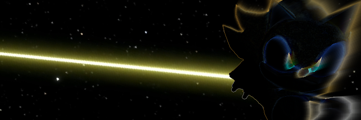
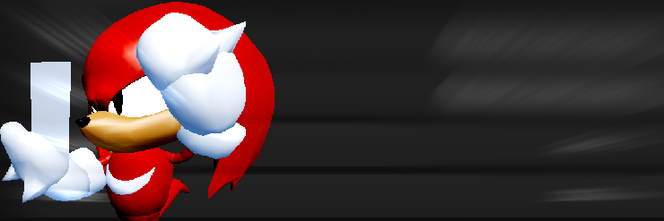

<head>
    <meta charset="UTF-8">
    <link rel="stylesheet" href = "estilo.css">
</head>
<body>

        <h1>MisterSaiyan's OM STUFF</h1>
        
    
Beginner Coder/Scripter
         Second-year University Student Computer Science Student Chilean

        

            i have no idea of what i am doing :P
        

        
This page mainly stores my OM/Roblox stuff if i keep doing this

        <h2>Public Scripts</h2>
        
Not all of these are final, as they are still being updated

        
Click the banners to view the pages

<h3>Super Sonic Custom Skin for Sonic (OM v0.2)</h3>
        

<h4>Simple OM Model Replacer (OM v0.2)</h4>

<h4>FNF Skins for Sonic and Amy</h4>

