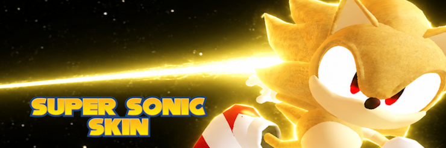
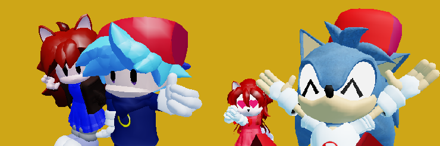
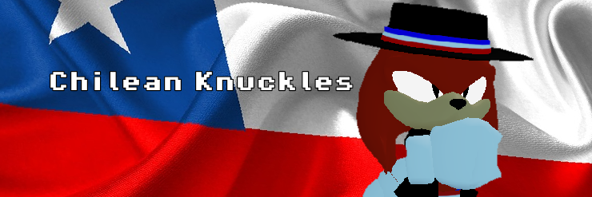

<head>
    <meta charset="UTF-8">
    <link rel="stylesheet" href = "estilo.css">
</head>
<body>

        <h1>MisterSaiyan's OM STUFF</h1>
        
        
Beginner Coder/Scripter
             Second-year University Student Computer Science Student Chilean

        

            i have no idea of what i am doing :P
        

        
This page mainly stores my OM/Roblox stuff if i keep doing this

        

        <h2>Public Scripts</h2>
        
Not all of these are final, as they are still being updated

        
Click the banners to view the pages

        
<a href="https://scriptblox.com/u/MisterSaiyan">
            Find me in scriptblox too :D
        </a>

<h3>Saiyan's Silly Super Sonic</h3>

Alpha Revision 2 | Outcome Memories

        

<h3>Simple OM Model Replacer (OM v0.2)</h3>

Funny Template | Outcome Memories

<h3>FNF Skins for Sonic and Amy</h3>

Custom Skins (V1 and V2) | Outcome Memories

<h3>Chilean Knuckles Skin</h3>

Custom Skin | Outcome Memories

